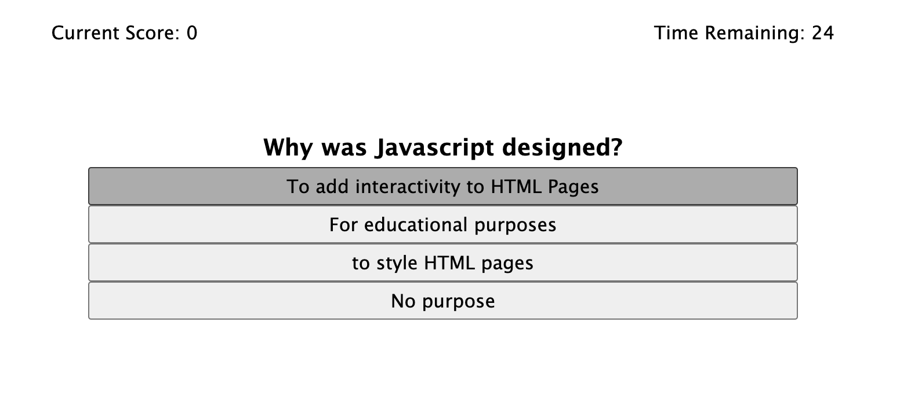

# <timed-quiz>

## Description

This project was created as a way to review JavaScript. This application generate a multiple choice test by using JS to interact with the DOM. Additionally, it uses Local Storage to save and pull previous quiz scores recieved on the browser to generate a leader baord. The quiz questions test basic understanding of JavaScript.

## Installation

No installation steps are necessary. To take the quiz, you need a working web browser. Navigate to this link to play: _______.

## Usage

To start the quiz, press the "start!" button. This will begin the clock and provide you with a multiple choice question. When you select an answer, you will either be assigned a point if the answer is corrected or docked 5 seconds if the answer is incorrect. The quiz ends when the timer runs out or you have answered all the questions. Submit your name to view the leaderboard and add your score.

## Credits

NA

## License

MIT license
